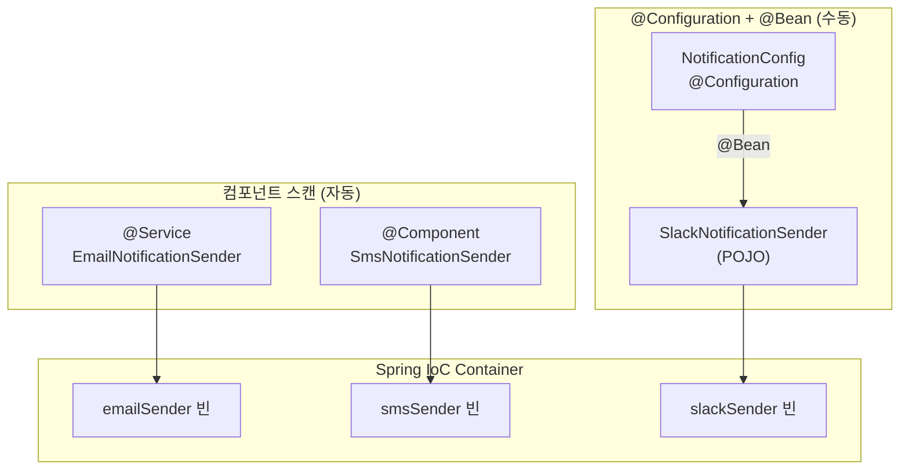
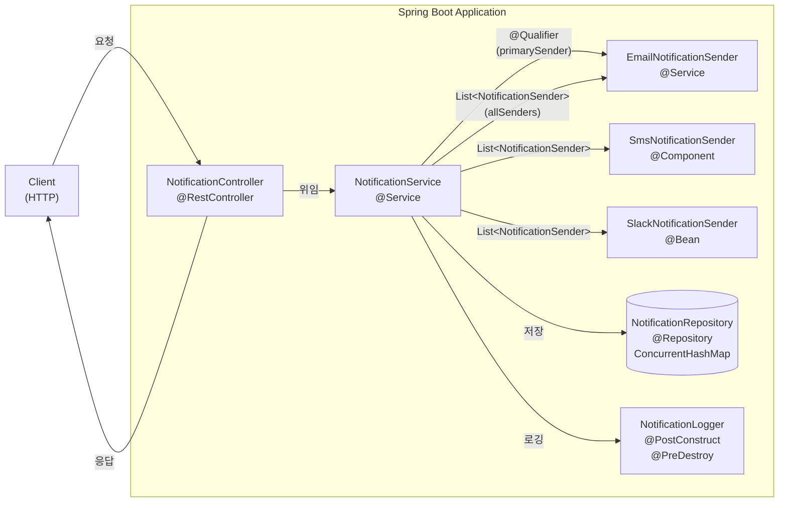
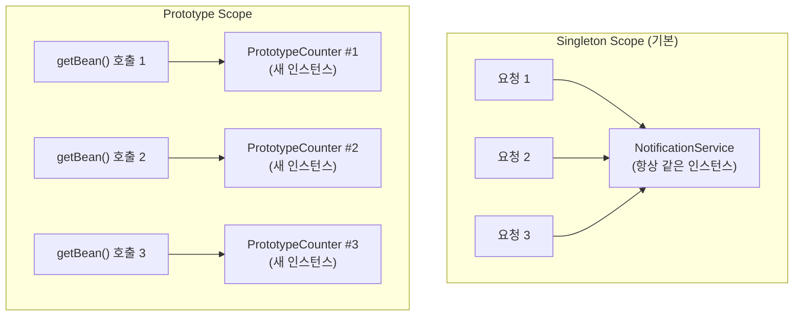
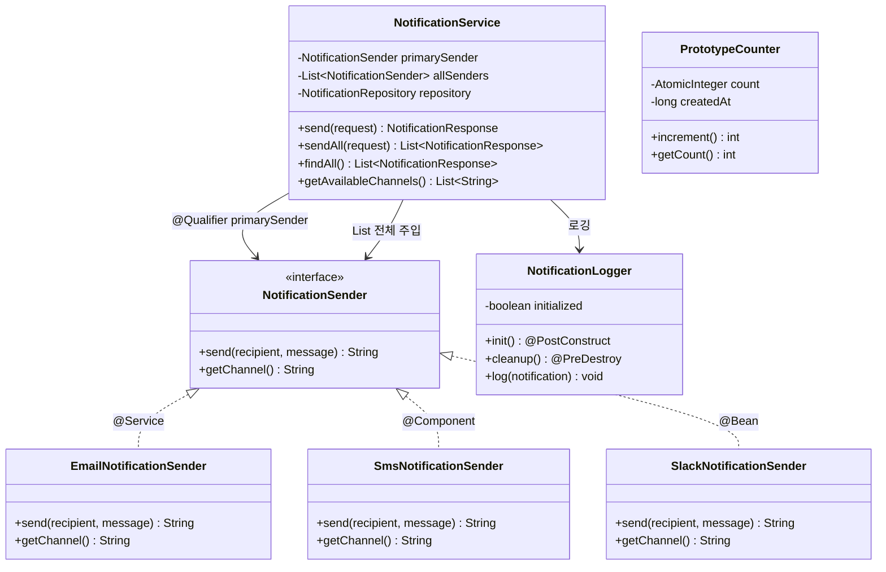

# Chapter 02-2 — DI/IoC 심화 (알림 서비스)

## 학습 목표

Spring의 핵심 원리인 **DI(Dependency Injection)**와 **IoC(Inversion of Control)**를 깊이 있게 학습합니다.
동일한 인터페이스의 여러 구현체를 등록하고 선택하는 실전 패턴을 알림 서비스 도메인으로 실습합니다.

## 학습 포인트

- `@Component`, `@Service`, `@Repository` 스테레오타입 차이
- `@Configuration` + `@Bean`으로 수동 빈 등록
- `@Qualifier`로 동일 타입 빈 중 특정 빈 선택
- `List<T>` 컬렉션 주입 (해당 타입의 모든 빈 자동 주입)
- Bean Scope — Singleton(기본) vs Prototype
- Lifecycle 콜백 — `@PostConstruct`, `@PreDestroy`

## 빈 등록 3가지 방식 비교

| 방식 | 클래스 | 어노테이션 | 설명 |
|------|--------|------------|------|
| 컴포넌트 스캔 | `EmailNotificationSender` | `@Service("emailSender")` | 가장 일반적인 방식 |
| 컴포넌트 스캔 | `SmsNotificationSender` | `@Component("smsSender")` | `@Service`와 기능 동일, 의미적 구분 |
| 수동 등록 | `SlackNotificationSender` | 없음 (POJO) | `@Configuration` 클래스의 `@Bean` 메서드로 등록 |

### 언제 `@Bean`을 쓰는가?

- 외부 라이브러리 클래스를 빈으로 등록할 때 (소스 코드를 수정할 수 없으므로 `@Component` 불가)
- 생성 로직이 복잡하거나 조건부 설정이 필요할 때

## API 목록

| Method | Path | 설명 |
|--------|------|------|
| `POST` | `/notifications` | 기본 채널(이메일)로 알림 전송 |
| `POST` | `/notifications/all` | 모든 채널로 알림 전송 |
| `GET` | `/notifications` | 전송된 알림 목록 조회 |
| `GET` | `/notifications/channels` | 사용 가능한 채널 목록 |
| `GET` | `/notifications/scope-demo` | Singleton vs Prototype 비교 |

## 주요 코드 사용법

### @Qualifier로 특정 빈 선택 + List 컬렉션 주입

`@Qualifier`는 동일 타입 빈이 여러 개일 때 특정 빈을 지정합니다.
Lombok `@RequiredArgsConstructor`는 `@Qualifier`를 복사하지 않으므로 명시적 생성자를 작성합니다.

```java
@Service
public class NotificationService {
    private final NotificationSender primarySender;     // 특정 빈 1개
    private final List<NotificationSender> allSenders;  // 해당 타입 전체

    public NotificationService(
            @Qualifier("emailSender") NotificationSender primarySender,
            List<NotificationSender> allSenders,
            NotificationRepository repository,
            NotificationLogger notificationLogger
    ) {
        this.primarySender = primarySender;   // emailSender 빈만 주입
        this.allSenders = allSenders;          // email + sms + slack 전부 주입
        // ...
    }
}
```

### @Configuration + @Bean 수동 빈 등록

외부 라이브러리나 `@Component`를 붙일 수 없는 클래스를 빈으로 등록할 때 사용합니다.

```java
@Configuration
public class NotificationConfig {
    @Bean("slackSender")
    public NotificationSender slackNotificationSender() {
        return new SlackNotificationSender();  // POJO — @Component 없음
    }
}
```

### @Scope("prototype") 빈

요청할 때마다 새 인스턴스를 생성합니다.

```java
@Configuration
public class AppConfig {
    @Bean
    @Scope("prototype")
    public PrototypeCounter prototypeCounter() {
        return new PrototypeCounter();  // 매번 새 인스턴스
    }
}
```

### @PostConstruct / @PreDestroy 생명주기 콜백

```java
@Component
public class NotificationLogger {
    @PostConstruct
    public void init() {
        // 빈 생성 + 의존성 주입 완료 후 호출
        log.info("NotificationLogger 빈이 초기화되었습니다");
    }

    @PreDestroy
    public void cleanup() {
        // 애플리케이션 종료 시 빈 소멸 직전 호출
        log.info("NotificationLogger 빈이 소멸됩니다");
    }
}
```

## 실행 방법

```bash
./gradlew :chapter02-2-di-ioc:bootRun
```

## 요청 예시

### 기본 채널로 전송

```bash
curl -X POST http://localhost:8080/notifications \
  -H "Content-Type: application/json" \
  -d '{"recipient":"user@example.com","message":"안녕하세요"}'
```

응답 (201 Created):
```json
{
  "id": 1,
  "channel": "EMAIL",
  "recipient": "user@example.com",
  "message": "안녕하세요",
  "sentAt": "2026-03-30 12:00:00"
}
```

### 전체 채널로 전송

```bash
curl -X POST http://localhost:8080/notifications/all \
  -H "Content-Type: application/json" \
  -d '{"recipient":"user@example.com","message":"전체 알림"}'
```

응답 (201 Created):
```json
[
  {"id": 1, "channel": "EMAIL", ...},
  {"id": 2, "channel": "SMS", ...},
  {"id": 3, "channel": "SLACK", ...}
]
```

### Scope 데모

```bash
curl http://localhost:8080/notifications/scope-demo
```

응답:
```json
{
  "prototype_같은_인스턴스인가": false,
  "prototype_counter1_id": 123456789,
  "prototype_counter2_id": 987654321,
  "singleton_service_hash": 1234567,
  "설명": "prototype은 매번 새 인스턴스, singleton은 항상 같은 인스턴스"
}
```

## 구조

```
com.adam9e96.chapter022diioc/
├── config/
│   ├── NotificationConfig.java    ← @Configuration + @Bean (Slack sender 수동 등록)
│   └── AppConfig.java             ← @Scope("prototype") 빈 등록
├── service/
│   ├── NotificationSender.java    ← 인터페이스 (전송 채널 추상화)
│   ├── EmailNotificationSender    ← @Service("emailSender")
│   ├── SmsNotificationSender      ← @Component("smsSender")
│   ├── SlackNotificationSender    ← POJO (@Bean으로만 등록)
│   ├── NotificationService        ← @Qualifier + List<T> 주입
│   ├── NotificationLogger         ← @PostConstruct / @PreDestroy
│   └── PrototypeCounter           ← Prototype scope 데모
├── repository/
│   └── NotificationRepository     ← @Repository (ConcurrentHashMap)
├── controller/
│   └── NotificationController     ← REST 엔드포인트
├── dto/
│   ├── NotificationRequest        ← Java Record
│   └── NotificationResponse       ← Java Record
└── model/
    └── Notification                ← Lombok 모델
```

## 구조 다이어그램

### 빈 등록 방식 비교



### 의존성 주입 흐름



### Bean Scope 비교



### 클래스 다이어그램



## 핵심 학습 포인트

1. **스테레오타입 어노테이션**: `@Component`(범용), `@Service`(비즈니스 로직), `@Repository`(데이터 접근), `@Controller`(웹 요청 처리) — 기능은 같지만 역할을 명확히 구분
2. **`@Configuration` + `@Bean`**: 외부 라이브러리 클래스나 생성 로직이 복잡한 빈을 수동으로 등록
3. **`@Qualifier`**: 동일 타입 빈이 여러 개일 때 이름으로 특정 빈을 선택. Lombok `@RequiredArgsConstructor`와 함께 쓸 수 없으므로 명시적 생성자 필요
4. **컬렉션 주입**: `List<NotificationSender>`로 해당 타입의 모든 빈을 한번에 주입
5. **Bean Scope**: Singleton은 앱 전체에서 하나, Prototype은 요청마다 새 인스턴스
6. **Lifecycle**: `@PostConstruct`(초기화 후), `@PreDestroy`(소멸 전) 콜백으로 빈 생명주기 관리
