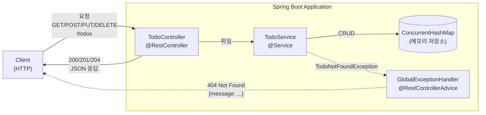
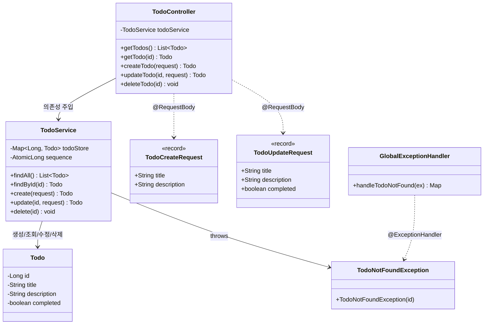

# Chapter 03. REST API Basics

Spring Boot에서 가장 기본적인 RESTful CRUD 패턴을 연습하는 챕터입니다.
DB 없이 메모리 저장소를 사용해서 HTTP 메서드와 요청/응답 흐름에 집중할 수 있도록 구성했습니다.

## 학습 포인트

- `@RestController`
- `@RequestMapping`
- `@GetMapping`, `@PostMapping`, `@PutMapping`, `@DeleteMapping`
- `@PathVariable`
- `@RequestBody`
- `201 Created`, `204 No Content`, `404 Not Found`

## API 목록

- `GET /todos` : 전체 조회
- `GET /todos/{id}` : 단건 조회
- `POST /todos` : 생성
- `PUT /todos/{id}` : 수정
- `DELETE /todos/{id}` : 삭제

## 실행 방법

```powershell
.\gradlew.bat :chapter03-1-rest-api-basics:bootRun
```

## 요청 예시

### 생성

```http
POST /todos
Content-Type: application/json

{
  "title": "Spring Boot 복습",
  "description": "REST API CRUD 다시 정리하기"
}
```

### 수정

```http
PUT /todos/1
Content-Type: application/json

{
  "title": "수정된 제목",
  "description": "설명 수정",
  "completed": true
}
```

## 구조

- `controller`: HTTP 요청 진입점
- `service`: 메모리 기반 CRUD 처리
- `dto`: 요청 바인딩용 객체
- `model`: Todo 도메인 객체
- `exception`: 404 응답 처리

### 요청 흐름도



### 클래스 다이어그램


