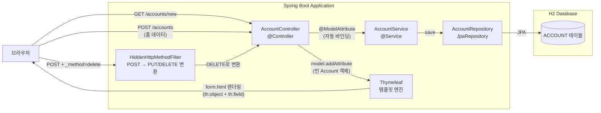
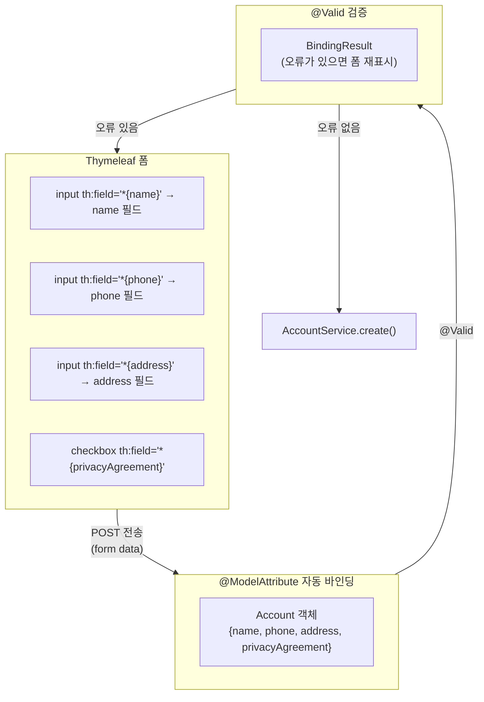
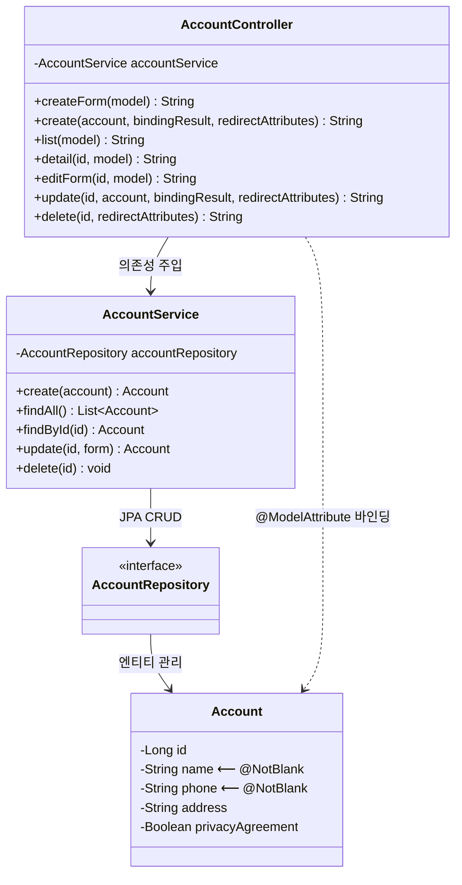

# Chapter 03-3 — MVC Model & 폼 바인딩 (계정 관리)

## 학습 목표

`@RestController`(JSON API)가 아닌 **`@Controller`(뷰 반환)** 방식의 Spring MVC를 학습합니다.
Thymeleaf 폼과 `@ModelAttribute`의 양방향 바인딩, HTML 폼에서 PUT/DELETE를 사용하는 HiddenHttpMethodFilter 패턴을 실습합니다.

## 학습 포인트

- `@Controller` vs `@RestController` 차이
- `@ModelAttribute`로 폼 데이터 ↔ 객체 양방향 바인딩
- `th:object` + `th:field`로 Thymeleaf 폼 바인딩
- `BindingResult`로 검증 오류 처리 및 폼 재표시
- `RedirectAttributes.addFlashAttribute()`로 리다이렉트 시 메시지 전달
- `HiddenHttpMethodFilter`로 HTML 폼에서 PUT/DELETE 요청

## `@Controller` vs `@RestController`

| | `@Controller` | `@RestController` |
|---|---|---|
| **반환값** | 뷰 이름 (String) | 응답 본문 (JSON) |
| **동작** | Thymeleaf가 템플릿을 렌더링 | Jackson이 객체를 JSON으로 직렬화 |
| **사용 시점** | 서버 사이드 렌더링 웹 페이지 | REST API |
| **예시** | `return "account/list"` | `return accountList` |

## HiddenHttpMethodFilter란?

HTML `<form>`은 `GET`과 `POST`만 지원합니다. PUT이나 DELETE를 사용하려면:

```html
<form method="post" action="/accounts/1">
    <input type="hidden" name="_method" value="delete"/>
    <button type="submit">삭제</button>
</form>
```

`HiddenHttpMethodFilter`가 `_method` 파라미터를 읽어 실제 HTTP 메서드를 변환합니다.

```yaml
# application.yaml에서 활성화
spring:
  mvc:
    hiddenmethod:
      filter:
        enabled: true
```

## 페이지 목록

| URL | 메서드 | 설명 |
|-----|--------|------|
| `/accounts` | GET | 계정 목록 |
| `/accounts/new` | GET | 계정 생성 폼 |
| `/accounts` | POST | 계정 생성 처리 |
| `/accounts/{id}` | GET | 계정 상세 |
| `/accounts/{id}/edit` | GET | 계정 수정 폼 |
| `/accounts/{id}` | PUT | 계정 수정 처리 (`_method=put`) |
| `/accounts/{id}` | DELETE | 계정 삭제 처리 (`_method=delete`) |

## 실행 방법

```bash
./gradlew :chapter03-3-mvc-model:bootRun
```

브라우저에서 `http://localhost:8080/accounts/new` 접속

## 구조

```
com.adam9e96.chapter033mvcmodel/
├── entity/
│   └── Account.java              ← @Entity + @ModelAttribute 바인딩 대상
├── repository/
│   └── AccountRepository.java    ← JpaRepository (H2 인메모리 DB)
├── service/
│   └── AccountService.java       ← @Service, @Transactional
├── controller/
│   └── AccountController.java    ← @Controller (뷰 반환)
└── templates/account/
    ├── form.html                 ← 생성 폼 (th:object + th:field)
    ├── list.html                 ← 목록 (th:each + _method=delete)
    ├── detail.html               ← 상세 보기
    └── edit.html                 ← 수정 폼 (_method=put)
```

## 구조 다이어그램

### 요청 흐름도



### @ModelAttribute 바인딩 흐름



### 클래스 다이어그램



## 핵심 학습 포인트

1. **`@Controller`**: 메서드가 반환하는 String은 뷰 이름이다. Thymeleaf가 `templates/` 아래에서 해당 이름의 HTML 파일을 찾아 렌더링한다
2. **`@ModelAttribute`**: 폼 데이터를 자바 객체로 자동 변환한다. `th:object`/`th:field`와 함께 양방향 바인딩을 구성한다
3. **`BindingResult`**: `@Valid` 검증 실패 시 오류 정보를 담는다. 뷰에서 `th:errors`로 필드별 에러 메시지를 표시할 수 있다
4. **`RedirectAttributes`**: `addFlashAttribute()`로 리다이렉트 후 한 번만 보여줄 메시지(성공/삭제 알림 등)를 전달한다
5. **HiddenHttpMethodFilter**: HTML 폼의 한계(GET/POST만 지원)를 극복하여 `_method` 히든 필드로 PUT/DELETE 요청을 보낸다
6. **PRG 패턴**: Post-Redirect-Get — 폼 제출(POST) 후 리다이렉트(GET)하여 새로고침 시 중복 제출을 방지한다
