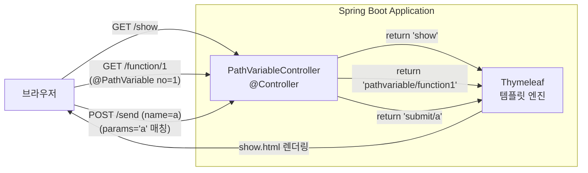
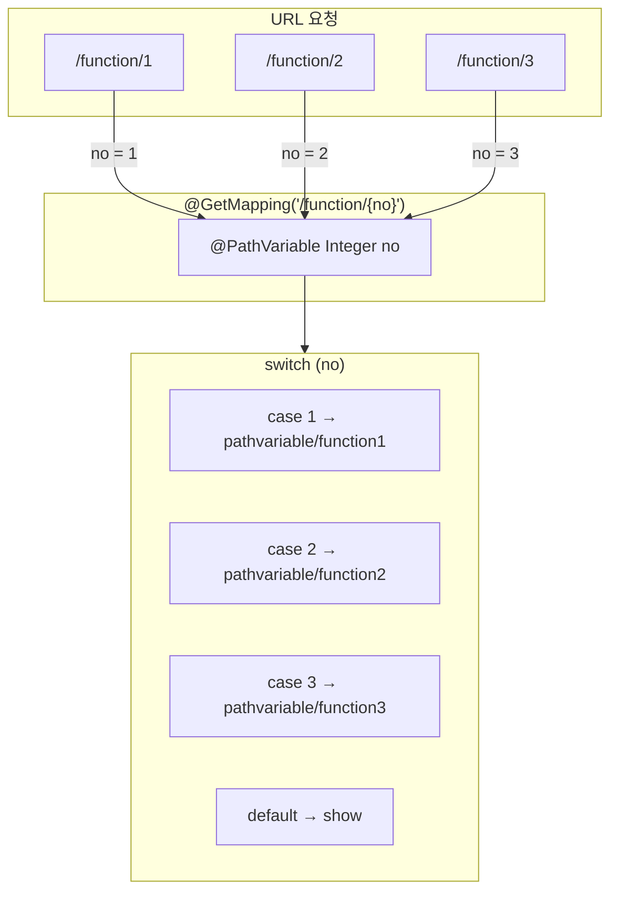
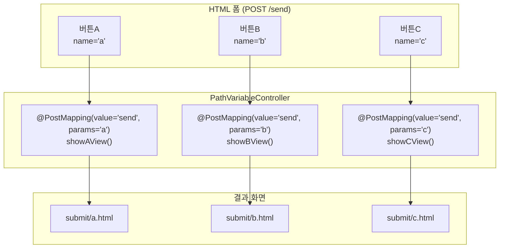

# Chapter 03-4 — 요청 매핑 패턴 (@PathVariable, params)

## 학습 목표

Spring MVC의 **요청 매핑(Request Mapping)** 패턴을 학습합니다.
URL 경로에 포함된 값을 `@PathVariable`로 추출하는 방법과, 같은 URL로 전송된 폼에서 `params` 속성으로 클릭된 버튼을 식별하는 방법을 실습합니다.

## 학습 포인트

- `@PathVariable`로 URL 경로 변수 추출 (`/function/{no}`)
- `@PostMapping(params = "...")` 으로 같은 URL의 버튼별 분기 처리
- Thymeleaf `@{...}` 표현식으로 동적 URL 생성
- `@Controller`에서 뷰 이름을 반환하여 Thymeleaf 템플릿 렌더링

## @PathVariable이란?

URL 경로의 일부를 변수로 사용하는 방식입니다. `{변수명}` 자리에 들어온 값을 메서드 파라미터로 받을 수 있습니다.

```java
@GetMapping("/function/{no}")
public String selectFunction(@PathVariable Integer no) {
    // /function/1 → no = 1
    // /function/2 → no = 2
}
```

### @PathVariable vs @RequestParam 비교

| | `@PathVariable` | `@RequestParam` |
|---|---|---|
| **URL 형태** | `/users/42` | `/users?id=42` |
| **용도** | 리소스 식별 (필수값) | 필터링, 옵션 (선택값 가능) |
| **REST 관례** | 특정 리소스 접근 시 사용 | 검색, 정렬 등 부가 조건 |

## params 속성이란?

같은 URL로 전송되는 여러 버튼을 구분하는 방법입니다. 폼 안에 여러 `submit` 버튼이 있을 때, 각 버튼의 `name` 속성으로 어떤 버튼이 눌렸는지 식별합니다.

```html
<form th:action="@{send}" method="post">
    <input type="submit" value="버튼A" name="a">
    <input type="submit" value="버튼B" name="b">
    <input type="submit" value="버튼C" name="c">
</form>
```

```java
@PostMapping(value = "send", params = "a")
public String showAView() { ... }  // 버튼A 클릭 시

@PostMapping(value = "send", params = "b")
public String showBView() { ... }  // 버튼B 클릭 시
```

## 페이지 목록

| URL | 메서드 | 설명 |
|-----|--------|------|
| `/show` | GET | 메인 화면 (링크 + 버튼 폼) |
| `/function/{no}` | GET | 경로 변수로 기능 화면 분기 (1, 2, 3) |
| `/send?a` | POST | 버튼 A 클릭 결과 |
| `/send?b` | POST | 버튼 B 클릭 결과 |
| `/send?c` | POST | 버튼 C 클릭 결과 |

## 실행 방법

```bash
./gradlew :chapter03-4-request-mapping:bootRun
```

브라우저에서 `http://localhost:8080/show` 접속

## 구조

```
com.adam9e96.chapter034requestmapping/
├── Chapter034RequestMappingApplication.java
└── controller/
    └── PathVariableController.java    ← @Controller (뷰 반환)

resources/templates/
├── show.html                          ← 메인 화면 (링크 3개 + 버튼 3개)
├── pathvariable/
│   ├── function1.html                 ← /function/1 결과
│   ├── function2.html                 ← /function/2 결과
│   └── function3.html                 ← /function/3 결과
└── submit/
    ├── a.html                         ← 버튼A 결과
    ├── b.html                         ← 버튼B 결과
    └── c.html                         ← 버튼C 결과
```

## 구조 다이어그램

### 요청 흐름도



### @PathVariable 동작 흐름



### params 분기 흐름



## 주요 코드 사용법

### @PathVariable — URL 경로 변수 추출

```java
@GetMapping("/function/{no}")
public String selectFunction(@PathVariable Integer no) {
    String view = switch (no) {    // Java 21 switch expression
        case 1 -> "pathvariable/function1";
        case 2 -> "pathvariable/function2";
        case 3 -> "pathvariable/function3";
        default -> "show";
    };
    return view;
}
```

`/function/1` 요청 → `no = 1` → `function1.html` 렌더링

### params 속성 — 같은 URL의 버튼별 분기

```java
@PostMapping(value = "send", params = "a")    // name="a" 버튼 클릭 시
public String showAView() { return "submit/a"; }

@PostMapping(value = "send", params = "b")    // name="b" 버튼 클릭 시
public String showBView() { return "submit/b"; }

@PostMapping(value = "send", params = "c")    // name="c" 버튼 클릭 시
public String showCView() { return "submit/c"; }
```

### Thymeleaf에서 @PathVariable URL 생성

```html
<!-- 정적 링크 -->
<a th:href="@{/function/1}">기능 1</a>

<!-- 동적 링크 — 변수 사용 -->
<a th:href="@{/function/{no}(no=${item.id})}">기능</a>

<!-- 버튼 분기 폼 -->
<form th:action="@{send}" method="post">
    <input type="submit" value="버튼A" name="a">
    <input type="submit" value="버튼B" name="b">
    <input type="submit" value="버튼C" name="c">
</form>
```

## 핵심 학습 포인트

1. **`@PathVariable`**: URL 경로의 `{변수}`를 메서드 파라미터로 자동 바인딩한다. 변수명이 같으면 `@PathVariable("no")`에서 이름 생략 가능
2. **`params` 속성**: 같은 URL + 같은 HTTP 메서드를 가진 여러 핸들러를 요청 파라미터로 구분한다. 폼의 submit 버튼 `name` 속성과 매칭
3. **Thymeleaf URL 표현식**: `@{/function/1}`은 컨텍스트 경로를 자동으로 포함하여 안전한 URL을 생성한다
4. **switch expression (Java 21)**: 기존 `switch` 문 대신 `->` 구문으로 간결하게 분기 처리. `default` 케이스로 예외 상황도 처리
