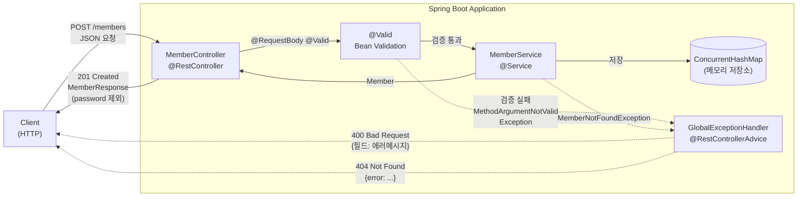
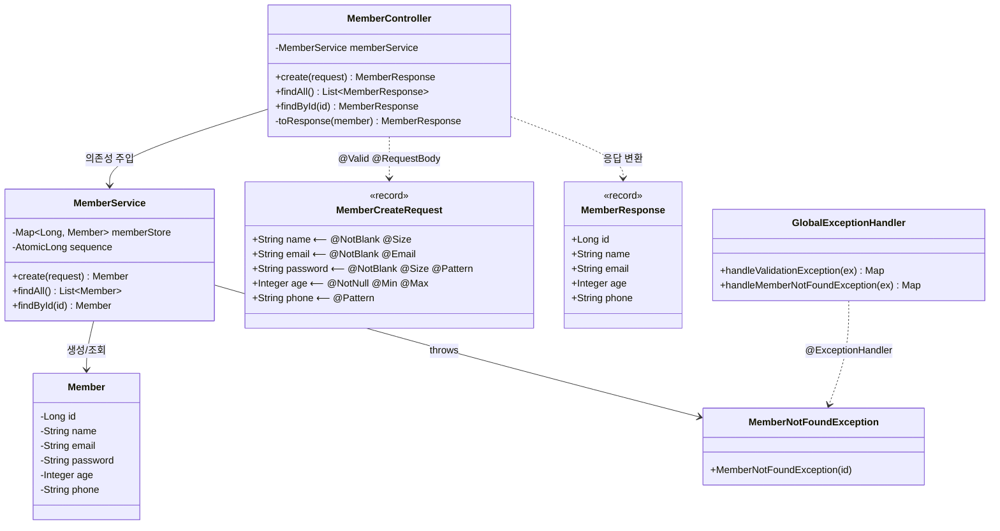
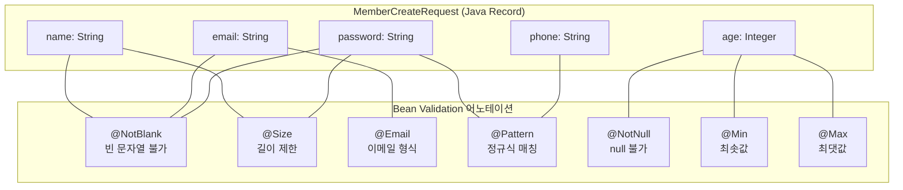

# Chapter 04 — Bean Validation (회원가입 API)

## 학습 목표

Spring Boot의 **Bean Validation**을 활용하여 회원가입 API를 구현합니다.
입력값 검증, 에러 응답 처리, DTO 패턴을 실습합니다.

## 챌린지

테스트 코드가 이미 작성되어 있습니다. **모든 테스트를 통과하도록 프로덕션 코드를 구현하세요.**

```bash
# 테스트 실행
./gradlew :chapter04-1-validation:test
```

## 구현해야 할 파일

### 1. DTO (Java Record)

#### `dto/MemberCreateRequest.java`
회원가입 요청 데이터를 담는 Record입니다. 다음 검증 규칙을 적용하세요:

| 필드 | 타입 | 검증 규칙 |
|------|------|-----------|
| `name` | `String` | `@NotBlank`, `@Size(min=2, max=20)` |
| `email` | `String` | `@NotBlank`, `@Email` |
| `password` | `String` | `@NotBlank`, `@Size(min=8, max=50)`, 영문자+숫자 모두 포함 (`@Pattern` 사용) |
| `age` | `Integer` | `@NotNull`, `@Min(0)`, `@Max(150)` |
| `phone` | `String` | `@Pattern` — 한국 전화번호 형식 (`010-xxxx-xxxx`) |

> **힌트**: 비밀번호의 영문자+숫자 조합 검증은 `@Pattern` 정규식으로 구현할 수 있습니다.
> 예: `(?=.*[a-zA-Z])(?=.*\\d).+`

#### `dto/MemberResponse.java`
회원 응답 데이터를 담는 Record입니다. **비밀번호는 포함하지 않습니다.**

| 필드 | 타입 |
|------|------|
| `id` | `Long` |
| `name` | `String` |
| `email` | `String` |
| `age` | `Integer` |
| `phone` | `String` |

### 2. Model

#### `model/Member.java`
Lombok을 사용한 회원 엔티티 클래스입니다.

- 필드: `id`, `name`, `email`, `password`, `age`, `phone`
- `@Getter`, `@Setter`, `@NoArgsConstructor`, `@AllArgsConstructor`, `@Builder` 등 활용

### 3. Service

#### `service/MemberService.java`
`@Service` 클래스입니다. 인메모리 저장소(`ConcurrentHashMap` + `AtomicLong`)를 사용합니다.

| 메서드 | 설명 |
|--------|------|
| `create(MemberCreateRequest)` | 회원 생성, `Member` 반환 |
| `findAll()` | 전체 회원 목록 반환 (`List<Member>`) |
| `findById(Long)` | ID로 회원 조회, 없으면 `MemberNotFoundException` 발생 |

### 4. Controller

#### `controller/MemberController.java`
`@RestController`, `@RequestMapping("/members")`

| 엔드포인트 | 메서드 | 설명 | 상태 코드 |
|------------|--------|------|-----------|
| `POST /members` | `create` | `@Valid @RequestBody`로 검증 후 생성 | 201 Created |
| `GET /members` | `findAll` | 전체 회원 목록 조회 | 200 OK |
| `GET /members/{id}` | `findById` | ID로 단건 조회 | 200 OK |

- 응답은 `MemberResponse`로 변환하여 반환합니다.
- `@RequiredArgsConstructor`로 생성자 주입을 사용합니다.

### 5. Exception

#### `exception/MemberNotFoundException.java`
- `RuntimeException`을 상속합니다.

#### `exception/GlobalExceptionHandler.java`
`@RestControllerAdvice` 클래스입니다.

| 처리 대상 | HTTP 상태 | 응답 형식 |
|-----------|-----------|-----------|
| `MemberNotFoundException` | 404 | `Map<String, String>` — `"error"` 키에 메시지 |
| `MethodArgumentNotValidException` | 400 | `Map<String, String>` — 필드명을 키, 에러 메시지를 값으로 |

## API 예시

### 회원 생성 (성공)
```bash
curl -X POST http://localhost:8080/members \
  -H "Content-Type: application/json" \
  -d '{
    "name": "홍길동",
    "email": "hong@example.com",
    "password": "Password1",
    "age": 25,
    "phone": "010-1234-5678"
  }'
```

응답 (201 Created):
```json
{
  "id": 1,
  "name": "홍길동",
  "email": "hong@example.com",
  "age": 25,
  "phone": "010-1234-5678"
}
```

### 검증 실패
```bash
curl -X POST http://localhost:8080/members \
  -H "Content-Type: application/json" \
  -d '{
    "name": "",
    "email": "notanemail",
    "password": "123",
    "age": -1,
    "phone": "01012345678"
  }'
```

응답 (400 Bad Request):
```json
{
  "name": "이름은 필수입니다",
  "email": "올바른 이메일 형식이 아닙니다",
  "password": "비밀번호는 8자 이상이어야 합니다",
  "age": "0 이상이어야 합니다",
  "phone": "전화번호 형식이 올바르지 않습니다 (010-xxxx-xxxx)"
}
```

## 구조 다이어그램

### 요청 흐름도



### 클래스 다이어그램



### Validation 어노테이션 매핑



## 핵심 학습 포인트

1. **Bean Validation 어노테이션**: `@NotBlank`, `@Size`, `@Email`, `@Min`, `@Max`, `@Pattern`, `@NotNull`
2. **`@Valid`와 `@RequestBody`**: 컨트롤러에서 요청 본문 자동 검증
3. **`MethodArgumentNotValidException` 처리**: 검증 실패 시 에러 응답 구성
4. **DTO 패턴**: 요청/응답에 서로 다른 DTO를 사용하여 보안(비밀번호 노출 방지)과 관심사 분리
5. **`@RestControllerAdvice`**: 전역 예외 처리로 일관된 에러 응답
