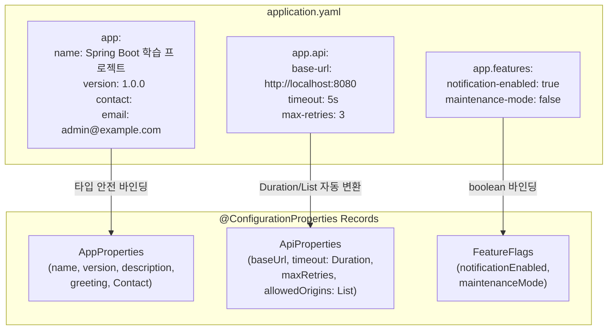
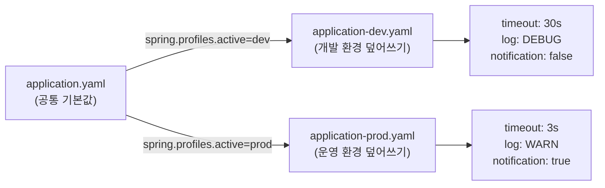
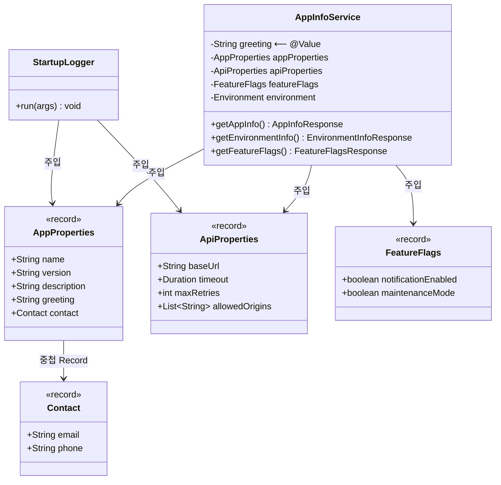

# Chapter 04-2 — 설정, 프로파일, 로깅

## 학습 목표

Spring Boot의 **외부 설정(External Configuration)** 체계를 학습합니다.
`@Value`와 `@ConfigurationProperties`의 차이, 프로파일별 설정 분리, 로깅 설정을 실습합니다.

## 학습 포인트

- `@Value("${key:default}")` — 단순 값 주입
- `@ConfigurationProperties` — Record 기반 타입 안전 바인딩
- `@ConfigurationPropertiesScan` — 자동 스캔 활성화
- Profile 분리 — `application-dev.yaml`, `application-prod.yaml`
- `logback-spring.xml` — 프로파일별 로그 포맷과 레벨
- `CommandLineRunner` — 시작 시 설정값 확인

## `@Value` vs `@ConfigurationProperties`

| | `@Value` | `@ConfigurationProperties` |
|---|---|---|
| **용도** | 단순한 값 하나 주입 | 관련 설정을 그룹으로 묶어 바인딩 |
| **타입 안전** | 문자열 기반 (오타 시 런타임 에러) | 컴파일 타임에 타입 체크 |
| **기본값** | `${key:기본값}` 문법 지원 | YAML에서 기본값 설정 |
| **중첩 구조** | 불가 | Record/클래스 중첩으로 자연스럽게 표현 |
| **IDE 지원** | 없음 | `configuration-processor`로 자동완성 지원 |
| **적합한 경우** | `spring.application.name` 같은 일회성 값 | API 설정, 기능 플래그 같은 구조화된 설정 |

## `@ConfigurationProperties` 사용법

### 1단계: YAML에 설정 정의

```yaml
# application.yaml
app:
  name: Spring Boot 학습 프로젝트
  version: 1.0.0
  contact:
    email: admin@example.com
    phone: 02-1234-5678
  api:
    base-url: http://localhost:8080
    timeout: 5s                    # → Duration.ofSeconds(5)
    max-retries: 3
    allowed-origins:               # → List<String>
      - http://localhost:3000
  features:
    notification-enabled: true
    maintenance-mode: false
```

### 2단계: Record로 바인딩 클래스 작성

YAML의 키 구조와 Record 필드가 1:1로 매핑된다. `kebab-case` → `camelCase` 변환은 자동이다.

```java
// app.* 바인딩 — 중첩 Record로 계층 구조 표현
@ConfigurationProperties(prefix = "app")
public record AppProperties(
        String name,
        String version,
        String description,
        String greeting,
        Contact contact          // app.contact.* → 중첩 Record
) {
    public record Contact(String email, String phone) {}
}

// app.api.* 바인딩 — Duration, List 등 다양한 타입 자동 변환
@ConfigurationProperties(prefix = "app.api")
public record ApiProperties(
        String baseUrl,          // base-url → baseUrl
        Duration timeout,        // "5s" → Duration.ofSeconds(5)
        int maxRetries,          // max-retries → maxRetries
        List<String> allowedOrigins
) {}

// app.features.* 바인딩 — boolean 플래그
@ConfigurationProperties(prefix = "app.features")
public record FeatureFlags(
        boolean notificationEnabled,
        boolean maintenanceMode
) {}
```

### 3단계: 스캔 활성화

`@SpringBootApplication` 클래스에 `@ConfigurationPropertiesScan`을 추가하면 `@ConfigurationProperties` Record를 자동으로 빈 등록한다.

```java
@SpringBootApplication
@ConfigurationPropertiesScan   // config 패키지의 Record들을 자동 스캔
public class Chapter042ConfigApplication { }
```

### 4단계: 주입해서 사용

```java
@Service
@RequiredArgsConstructor
public class AppInfoService {
    private final AppProperties appProperties;
    private final ApiProperties apiProperties;

    public String getAppName() {
        return appProperties.name();          // Record이므로 getter가 아닌 접근자 메서드
    }

    public Duration getTimeout() {
        return apiProperties.timeout();       // Duration 타입으로 바로 사용
    }
}
```

### 자동 변환되는 타입들

| YAML 값 | Java 타입 | 예시 |
|---------|----------|------|
| `5s`, `1m`, `2h` | `Duration` | `timeout: 5s` → `Duration.ofSeconds(5)` |
| `10MB`, `1GB` | `DataSize` | `max-size: 10MB` → `DataSize.ofMegabytes(10)` |
| 리스트 | `List<T>` | `origins: [a, b]` → `List.of("a", "b")` |
| 중첩 구조 | 중첩 Record | `contact.email` → `Contact(email)` |
| `true`/`false` | `boolean` | `enabled: true` → `true` |

## 프로파일별 설정 차이

| 설정 | default | dev | prod |
|------|---------|-----|------|
| greeting | 안녕하세요 | [DEV] 개발 환경입니다 | [PROD] 운영 환경입니다 |
| API base URL | localhost:8080 | localhost:8080 | api.example.com |
| API timeout | 5s | 30s | 3s |
| max-retries | 3 | 5 | 2 |
| notification | true | false | true |
| 로그 레벨 | INFO | DEBUG | WARN |

## API 목록

| Method | Path | 설명 |
|--------|------|------|
| `GET` | `/app/info` | 앱 이름, 버전, 설명, 연락처 |
| `GET` | `/app/environment` | 활성 프로파일, API 설정, greeting |
| `GET` | `/app/features` | 기능 플래그 상태 |

## 실행 방법

```bash
# 기본 프로파일로 실행
./gradlew :chapter04-2-config:bootRun

# dev 프로파일로 실행
./gradlew :chapter04-2-config:bootRun --args='--spring.profiles.active=dev'

# prod 프로파일로 실행
./gradlew :chapter04-2-config:bootRun --args='--spring.profiles.active=prod'
```

## 요청 예시

### 앱 정보 조회

```bash
curl http://localhost:8080/app/info
```

응답:
```json
{
  "name": "Spring Boot 학습 프로젝트",
  "version": "1.0.0",
  "description": "설정과 프로파일을 배우는 챕터입니다",
  "contactEmail": "admin@example.com",
  "contactPhone": "02-1234-5678"
}
```

### 환경 정보 조회 (기본 프로파일)

```bash
curl http://localhost:8080/app/environment
```

응답:
```json
{
  "activeProfiles": ["default"],
  "greeting": "안녕하세요",
  "apiBaseUrl": "http://localhost:8080",
  "apiTimeout": "PT5S",
  "apiMaxRetries": 3,
  "allowedOrigins": ["http://localhost:3000"],
  "notificationEnabled": true,
  "maintenanceMode": false
}
```

### 환경 정보 조회 (dev 프로파일)

```json
{
  "activeProfiles": ["dev"],
  "greeting": "[DEV] 개발 환경입니다",
  "apiBaseUrl": "http://localhost:8080",
  "apiTimeout": "PT30S",
  "apiMaxRetries": 5,
  "allowedOrigins": ["http://localhost:3000"],
  "notificationEnabled": false,
  "maintenanceMode": false
}
```

### 기능 플래그 조회

```bash
curl http://localhost:8080/app/features
```

응답:
```json
{
  "notificationEnabled": true,
  "maintenanceMode": false
}
```

## 구조

```
com.adam9e96.chapter042config/
├── config/
│   ├── AppProperties.java         ← @ConfigurationProperties("app") Record
│   ├── ApiProperties.java         ← @ConfigurationProperties("app.api") Record
│   └── FeatureFlags.java          ← @ConfigurationProperties("app.features") Record
├── service/
│   └── AppInfoService.java        ← @Value vs @ConfigurationProperties 비교
├── controller/
│   └── AppInfoController.java     ← 설정값 조회 엔드포인트
├── dto/
│   ├── AppInfoResponse.java       ← Java Record
│   ├── EnvironmentInfoResponse    ← Java Record
│   └── FeatureFlagsResponse       ← Java Record
├── runner/
│   └── StartupLogger.java         ← CommandLineRunner (시작 시 설정 출력)
└── resources/
    ├── application.yaml           ← 공통 설정
    ├── application-dev.yaml       ← 개발 환경
    ├── application-prod.yaml      ← 운영 환경
    └── logback-spring.xml         ← 프로파일별 로그 설정
```

## 구조 다이어그램

### 설정 바인딩 흐름



### 프로파일 설정 오버라이드



### 클래스 다이어그램



## 설정 파일 우선순위

Spring Boot는 설정을 다음 순서로 적용합니다 (아래가 더 높은 우선순위):

```
1. application.yaml (기본)
2. application-{profile}.yaml (프로파일별 — 기본값을 덮어씀)
3. 환경 변수 (SPRING_APPLICATION_NAME=...)
4. 커맨드라인 인자 (--spring.profiles.active=dev)
```

## 배포 시 환경 관리 전략

### 원칙: 코드는 환경을 모르게, 환경이 코드에 주입하게

리포지토리에는 **개발 환경 기본값**으로 커밋하고, 배포 환경에서 외부로 오버라이드합니다.

### 민감한 값은 yaml에 직접 쓰지 않는다

```yaml
# application-prod.yaml (커밋됨 — 구조만 정의, 실제 값은 환경변수로 주입)
spring:
  datasource:
    url: ${DB_URL}
    password: ${DB_PASSWORD}
```

### 배포 환경별 프로파일 활성화

```bash
# Docker
docker run -e SPRING_PROFILES_ACTIVE=prod -e DB_PASSWORD=xxx app

# Kubernetes
env:
  - name: SPRING_PROFILES_ACTIVE
    value: "prod"
  - name: DB_PASSWORD
    valueFrom:
      secretKeyRef:
        name: db-secret
        key: password

# Railway / PaaS
# 대시보드에서 환경변수 설정:
#   SPRING_PROFILES_ACTIVE = prod
#   DB_URL = jdbc:mysql://xxx
#   DB_PASSWORD = 실제비밀번호

# 직접 실행
java -jar app.jar --spring.profiles.active=prod
```

### 정리

| 항목 | 리포지토리 (커밋) | 배포 인프라 (환경변수) |
|------|------------------|----------------------|
| 공통 설정 | `application.yaml` | — |
| 개발 설정 | `application-dev.yaml` | — |
| 운영 설정 구조 | `application-prod.yaml` | — |
| 민감한 값 (DB, API 키) | `${ENV_VAR}` 플레이스홀더 | 실제 값 주입 |
| 활성 프로파일 | `active: dev` (기본) | `SPRING_PROFILES_ACTIVE=prod` |

## 핵심 학습 포인트

1. **`@ConfigurationProperties` + Record**: 불변(immutable) 설정 객체. setter 없이 생성자 바인딩으로 안전하게 값을 매핑한다
2. **`@ConfigurationPropertiesScan`**: `@EnableConfigurationProperties` 대신 패키지 스캔으로 자동 등록한다
3. **Profile 분리**: `application-{profile}.yaml`로 환경별 설정을 분리하고, `--spring.profiles.active`로 선택한다
4. **`logback-spring.xml`의 `<springProfile>`**: 프로파일에 따라 로그 포맷과 레벨을 다르게 설정한다
5. **`Duration` 바인딩**: `5s`, `30s`, `1h` 같은 문자열이 `java.time.Duration`으로 자동 변환된다
6. **`configuration-processor`**: `@ConfigurationProperties` 메타데이터를 생성하여 IDE에서 YAML 자동완성을 제공한다
