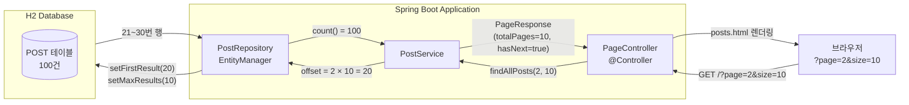
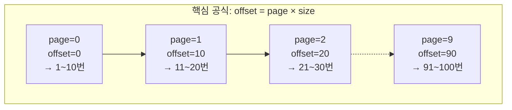

# Chapter 05-2 — 페이지네이션 기초 (수동 오프셋 방식)

## 학습 목표

페이지네이션의 **원리**를 직접 구현하며 이해합니다.
Spring Data의 `Page`/`Pageable`을 사용하지 않고, EntityManager의 JPQL로
오프셋 기반 페이지네이션을 처음부터 만들어봅니다.

## 학습 포인트

- 오프셋 기반 페이지네이션의 핵심 공식: `offset = page × size`
- EntityManager의 `setFirstResult()` / `setMaxResults()`
- 페이지네이션 메타데이터 (totalPages, hasNext, hasPrevious) 직접 계산
- 커스텀 `PageResponse<T>` DTO 설계
- Thymeleaf 페이지 네비게이션 UI

## 오프셋 페이지네이션이란?

전체 데이터에서 **N개를 건너뛰고(offset)** **M개를 가져오는(limit)** 방식입니다.

```
전체 데이터: [1, 2, 3, 4, 5, 6, 7, 8, 9, 10, ...]

page=0, size=3 → offset=0  → [1, 2, 3]
page=1, size=3 → offset=3  → [4, 5, 6]
page=2, size=3 → offset=6  → [7, 8, 9]
```

SQL로 표현하면:

```sql
SELECT * FROM post ORDER BY id LIMIT 3 OFFSET 6;  -- 3페이지
```

## 주요 코드 사용법

### EntityManager로 수동 페이지네이션

```java
@Repository
@RequiredArgsConstructor
public class PostRepository {
    private final EntityManager entityManager;

    public List<Post> findAllWithPaging(int offset, int limit) {
        return entityManager.createQuery("SELECT p FROM Post p ORDER BY p.id", Post.class)
                .setFirstResult(offset)   // 건너뛸 행 수
                .setMaxResults(limit)     // 가져올 행 수
                .getResultList();
    }

    public long count() {
        return entityManager.createQuery("SELECT COUNT(p) FROM Post p", Long.class)
                .getSingleResult();
    }
}
```

### 커스텀 PageResponse DTO

페이지네이션에 필요한 메타데이터를 직접 계산합니다.

```java
public record PageResponse<T>(
        List<T> content,         // 현재 페이지 데이터
        int pageNumber,          // 현재 페이지 (0부터)
        int pageSize,            // 페이지당 항목 수
        long totalElements,      // 전체 항목 수
        int totalPages,          // 전체 페이지 수
        boolean hasNext,         // 다음 페이지 존재 여부
        boolean hasPrevious      // 이전 페이지 존재 여부
) {
    public static <T> PageResponse<T> of(List<T> content, int pageNumber, int pageSize, long totalElements) {
        int totalPages = (int) Math.ceil((double) totalElements / pageSize);
        boolean hasNext = pageNumber < totalPages - 1;
        boolean hasPrevious = pageNumber > 0;
        return new PageResponse<>(content, pageNumber, pageSize, totalElements, totalPages, hasNext, hasPrevious);
    }
}
```

### Service — 페이지 번호를 오프셋으로 변환

```java
public PageResponse<Post> findAllPosts(int page, int size) {
    int offset = page * size;   // 핵심 공식
    List<Post> posts = postRepository.findAllWithPaging(offset, size);
    long totalElements = postRepository.count();
    return PageResponse.of(posts, page, size, totalElements);
}
```

### Controller — @RequestParam으로 페이지 파라미터 수신

```java
@GetMapping("/")
public String list(
        @RequestParam(defaultValue = "0") int page,
        @RequestParam(defaultValue = "10") int size,
        Model model
) {
    model.addAttribute("posts", postService.findAllPosts(page, size));
    return "posts";
}
```

### Thymeleaf 페이지 네비게이션

```html
<div class="pagination">
    <!-- 이전 버튼 -->
    <a th:if="${posts.hasPrevious}"
       th:href="@{/(page=${posts.pageNumber - 1}, size=${posts.pageSize})}">
        &laquo; 이전
    </a>

    <!-- 페이지 번호 (0-based → 1-based 표시) -->
    <th:block th:each="i : ${#numbers.sequence(0, posts.totalPages - 1)}">
        <span th:if="${i == posts.pageNumber}" class="active" th:text="${i + 1}">1</span>
        <a th:unless="${i == posts.pageNumber}"
           th:href="@{/(page=${i}, size=${posts.pageSize})}"
           th:text="${i + 1}">1</a>
    </th:block>

    <!-- 다음 버튼 -->
    <a th:if="${posts.hasNext}"
       th:href="@{/(page=${posts.pageNumber + 1}, size=${posts.pageSize})}">
        다음 &raquo;
    </a>
</div>
```

## 실행 방법

```bash
./gradlew :chapter05-2-pagination-basic:bootRun
```

브라우저에서 `http://localhost:8080` 접속

## 페이지 목록

| URL | 메서드 | 설명 |
|-----|--------|------|
| `/?page=0&size=10` | GET | 게시글 목록 (페이지네이션) |

## 구조

```
com.adam9e96.chapter052paginationbasic/
├── entity/
│   └── Post.java                ← @Entity (id, title, content)
├── repository/
│   └── PostRepository.java      ← EntityManager 수동 페이지네이션
├── service/
│   └── PostService.java         ← offset 계산 + PageResponse 생성
├── dto/
│   └── PageResponse.java        ← 커스텀 페이지네이션 응답 Record
├── controller/
│   └── PageController.java      ← @Controller (Thymeleaf)
├── config/
│   └── DataInitializer.java     ← 테스트 데이터 100건 생성
└── resources/
    ├── application.yaml
    └── templates/posts.html     ← 목록 + 페이지 네비게이션
```

## 구조 다이어그램

### 오프셋 페이지네이션 동작 흐름



### 오프셋 계산 시각화



## 오프셋 방식의 한계

| 문제 | 설명 |
|------|------|
| **성능 저하** | offset이 클수록 DB가 앞의 행을 모두 스캔 후 건너뜀 (page=10000이면 10만 행 스캔) |
| **데이터 누락/중복** | 조회 중 새 데이터가 삽입되면 페이지가 밀려서 같은 항목이 두 번 보이거나 빠질 수 있음 |
| **COUNT 쿼리 비용** | 전체 건수를 매번 조회해야 하므로 대용량 테이블에서 느림 |

이 한계를 극복하는 현대적 방식은 **chapter05-3**에서 다룹니다.

## 핵심 학습 포인트

1. **오프셋 공식**: `offset = page × size` — 페이지 번호를 DB가 이해하는 offset으로 변환
2. **setFirstResult/setMaxResults**: JPA에서 오프셋과 리밋을 지정하는 표준 API
3. **메타데이터 계산**: `totalPages = ceil(totalElements / pageSize)`, `hasNext = page < totalPages - 1`
4. **0-based vs 1-based**: 내부는 0부터, UI 표시는 1부터 — 변환 주의
5. **COUNT 쿼리**: 전체 페이지 수를 알려면 별도의 count 쿼리가 필수
