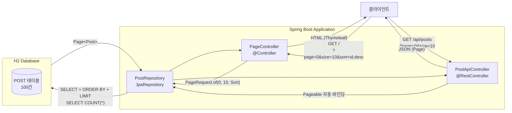
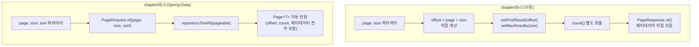

# Chapter 05-3 — 현대적 페이지네이션 (Spring Data)

## 학습 목표

chapter05-2에서 수동으로 구현했던 페이지네이션을 **Spring Data JPA**의 `Page`/`Pageable`로 대체합니다.
정렬, 검색+페이지네이션, REST API 페이지네이션까지 프레임워크가 제공하는 기능을 활용합니다.

## 학습 포인트

- `Page<T>`, `Pageable`, `PageRequest` — Spring Data 페이지네이션 핵심 타입
- `@PageableDefault`로 REST API 기본값 설정
- `Sort`를 활용한 정렬 페이지네이션
- 쿼리 메서드 + 페이지네이션 조합 (`findByTitleContaining`)
- MVC(Thymeleaf)와 REST API 동시 제공

## chapter05-2 vs chapter05-3 비교

| 항목 | chapter05-2 (수동) | chapter05-3 (Spring Data) |
|------|-------------------|---------------------------|
| **Repository** | EntityManager 직접 사용 | `JpaRepository` 상속 |
| **반환 타입** | 커스텀 `PageResponse<T>` | Spring Data `Page<T>` |
| **offset 계산** | `page × size` 직접 계산 | `PageRequest.of(page, size)` |
| **count 쿼리** | 수동 호출 | 자동 실행 |
| **정렬** | JPQL에 직접 ORDER BY | `Sort` 객체로 동적 지정 |
| **검색+페이징** | 직접 구현 필요 | 쿼리 메서드에 `Pageable` 추가 |
| **REST API** | 직접 구현 | `Pageable` 파라미터 자동 바인딩 |

## 주요 코드 사용법

### JpaRepository — 페이지네이션 자동 제공

```java
public interface PostRepository extends JpaRepository<Post, Long> {
    // findAll(Pageable)은 JpaRepository가 이미 제공

    // 검색 + 페이지네이션: 메서드 이름만으로 쿼리 생성
    Page<Post> findByTitleContaining(String keyword, Pageable pageable);
}
```

chapter05-2에서 직접 만들었던 `findAllWithPaging()`, `count()` 메서드가 전부 불필요합니다.

### PageRequest — 페이지 번호 + 크기 + 정렬

```java
// 기본 요청
PageRequest.of(0, 10);                              // 1페이지, 10개씩

// 정렬 포함
PageRequest.of(0, 10, Sort.by("id").descending());   // ID 내림차순

// 복합 정렬
PageRequest.of(0, 10, Sort.by("title").ascending()
                           .and(Sort.by("id").descending()));
```

### Controller (MVC) — 정렬 지원 페이지네이션

```java
@GetMapping("/")
public String list(
        @RequestParam(defaultValue = "0") int page,
        @RequestParam(defaultValue = "10") int size,
        @RequestParam(defaultValue = "id") String sort,
        @RequestParam(defaultValue = "asc") String direction,
        Model model
) {
    Sort sortOrder = direction.equalsIgnoreCase("desc")
            ? Sort.by(sort).descending()
            : Sort.by(sort).ascending();

    model.addAttribute("posts", postRepository.findAll(PageRequest.of(page, size, sortOrder)));
    return "posts";
}
```

### REST API — Pageable 자동 바인딩

Spring이 `?page=0&size=10&sort=id,desc` 쿼리 파라미터를 `Pageable` 객체로 자동 변환합니다.

```java
@RestController
@RequestMapping("/api/posts")
public class PostApiController {

    // GET /api/posts?page=0&size=10&sort=id,desc
    @GetMapping
    public Page<Post> findAll(@PageableDefault(size = 10) Pageable pageable) {
        return postRepository.findAll(pageable);
    }

    // GET /api/posts/search?keyword=게시글&page=0&size=10
    @GetMapping("/search")
    public Page<Post> search(@RequestParam String keyword,
                             @PageableDefault(size = 10) Pageable pageable) {
        return postRepository.findByTitleContaining(keyword, pageable);
    }
}
```

### Page 응답 JSON 구조

```json
{
  "content": [
    {"id": 1, "title": "게시글 1", "content": "내용 1"},
    {"id": 2, "title": "게시글 2", "content": "내용 2"}
  ],
  "pageable": {
    "pageNumber": 0,
    "pageSize": 10,
    "sort": {"sorted": true, "direction": "ASC"}
  },
  "totalElements": 100,
  "totalPages": 10,
  "first": true,
  "last": false,
  "number": 0,
  "size": 10,
  "numberOfElements": 10
}
```

### Thymeleaf에서 Page 객체 사용

Spring Data `Page<T>`의 속성명은 커스텀 DTO와 다릅니다:

| 커스텀 PageResponse | Spring Data Page | 설명 |
|---------------------|-----------------|------|
| `pageNumber` | `number` | 현재 페이지 |
| `pageSize` | `size` | 페이지 크기 |
| `hasPrevious` | `hasPrevious()` | 이전 페이지 존재 |
| `hasNext` | `hasNext()` | 다음 페이지 존재 |

```html
<!-- 정렬 가능한 테이블 헤더 -->
<th>
    <a th:href="@{/(page=${posts.number}, size=${posts.size},
       sort='id', direction=${currentDirection == 'asc' ? 'desc' : 'asc'})}">
        ID <span th:if="${currentSort == 'id'}"
                 th:text="${currentDirection == 'asc' ? '▲' : '▼'}"></span>
    </a>
</th>

<!-- 페이지 네비게이션 -->
<a th:if="${posts.hasPrevious()}"
   th:href="@{/(page=${posts.number - 1}, size=${posts.size})}">
    &laquo; 이전
</a>
```

## 실행 방법

```bash
./gradlew :chapter05-3-pagination-modern:bootRun
```

- 브라우저: `http://localhost:8080`
- REST API: `http://localhost:8080/api/posts?page=0&size=10`

## API 목록

| Method | Path | 설명 |
|--------|------|------|
| `GET` | `/` | Thymeleaf 게시글 목록 (정렬 지원) |
| `GET` | `/api/posts` | REST API 페이지네이션 |
| `GET` | `/api/posts/search?keyword=` | 키워드 검색 + 페이지네이션 |

## 요청 예시

### 기본 조회

```bash
curl "http://localhost:8080/api/posts?page=0&size=5"
```

### 정렬 조회

```bash
curl "http://localhost:8080/api/posts?page=0&size=5&sort=id,desc"
```

### 검색 + 페이지네이션

```bash
curl "http://localhost:8080/api/posts/search?keyword=게시글 1&page=0&size=10"
```

## 구조

```
com.adam9e96.chapter053paginationmodern/
├── entity/
│   └── Post.java                  ← @Entity (id, title, content)
├── repository/
│   └── PostRepository.java        ← JpaRepository + findByTitleContaining
├── controller/
│   ├── PageController.java        ← @Controller (Thymeleaf + 정렬)
│   └── PostApiController.java     ← @RestController (REST API)
├── config/
│   └── DataInitializer.java       ← 테스트 데이터 100건 생성
└── resources/
    ├── application.yaml
    └── templates/posts.html       ← 정렬 가능 테이블 + 페이지 네비게이션
```

## 구조 다이어그램

### Spring Data 페이지네이션 흐름



### 수동 vs Spring Data 비교



## 페이지네이션 전략 비교

| 전략 | 장점 | 단점 | 적합한 경우 |
|------|------|------|------------|
| **오프셋 기반** (이 챕터) | 구현 간단, 특정 페이지 이동 가능 | 대용량에서 성능 저하, 데이터 누락 가능 | 관리자 페이지, 일반 게시판 |
| **커서 기반** | 대용량에서도 일정한 성능 | 특정 페이지 번호 이동 불가 | 무한 스크롤, SNS 피드 |
| **키셋 기반** | 커서보다 구현 간단, 성능 좋음 | WHERE 조건이 복잡해질 수 있음 | 타임라인, 최신 순 정렬 |

## `@PageableDefault` 상세

`Pageable` 파라미터에 붙여서 클라이언트가 쿼리 파라미터를 생략했을 때 적용할 기본값을 선언합니다.

### 속성 목록

| 속성 | 타입 | 기본값 | 설명 |
|------|------|--------|------|
| `size` (= `value`) | `int` | `10` | 한 페이지에 포함할 항목 수 |
| `page` | `int` | `0` | 기본 페이지 번호 (0부터 시작) |
| `sort` | `String[]` | `{}` | 정렬 기준 필드명 (여러 개 가능) |
| `direction` | `Sort.Direction` | `ASC` | 정렬 방향 (`ASC` / `DESC`) |

### 사용 예시

```java
// 기본: 10건씩
@GetMapping
public Page<Post> findAll(@PageableDefault(size = 10) Pageable pageable) {
    return postRepository.findAll(pageable);
}

// 5건씩, id 내림차순 정렬
@GetMapping
public Page<Post> findAll(
        @PageableDefault(size = 5, sort = "id", direction = Sort.Direction.DESC) Pageable pageable) {
    return postRepository.findAll(pageable);
}

// 복합 정렬: createdDate, id 두 필드 기준 (direction은 모든 필드에 동일 적용)
@GetMapping
public Page<Post> findAll(
        @PageableDefault(size = 10, sort = {"createdDate", "id"}, direction = Sort.Direction.DESC) Pageable pageable) {
    return postRepository.findAll(pageable);
}
```

### 동작 원리

1. 클라이언트가 `?page=&size=&sort=` 쿼리 파라미터를 보내면 → 해당 값으로 `Pageable` 생성
2. 쿼리 파라미터를 **생략**하면 → `@PageableDefault`에 선언한 값으로 `Pageable` 생성
3. `@PageableDefault` 자체가 없으면 → Spring 글로벌 기본값 적용 (`page=0`, `size=20`)

### `application.yaml`로 글로벌 기본값 변경

`@PageableDefault`는 메서드 단위 기본값이고, 앱 전체 기본값은 설정 파일에서 변경할 수 있습니다:

```yaml
spring:
  data:
    web:
      pageable:
        default-page-size: 20    # 기본 페이지 크기
        max-page-size: 100       # 최대 허용 페이지 크기
        one-indexed-parameters: false  # true면 page=1이 첫 페이지
```

> `@PageableDefault`가 선언된 메서드는 글로벌 설정보다 **어노테이션 값이 우선**합니다.

## 핵심 학습 포인트

1. **`Page<T>`**: content + 페이지 메타데이터(totalPages, totalElements, hasNext 등)를 하나로 감싼 Spring Data 타입
2. **`Pageable`**: 페이지 요청 정보(page, size, sort)를 캡슐화. Controller 파라미터에 선언하면 쿼리 파라미터가 자동 바인딩
3. **`PageRequest.of()`**: `Pageable` 구현체 생성 팩토리. 정렬까지 한번에 지정 가능
4. **`@PageableDefault`**: REST API에서 기본 페이지 크기, 정렬을 어노테이션으로 선언
5. **쿼리 메서드 + Pageable**: `findByTitleContaining(keyword, pageable)` — 검색과 페이지네이션을 한 줄로 조합
6. **Service 계층 생략**: 단순 조회는 Controller → Repository 직접 호출도 실무에서 허용되는 패턴
